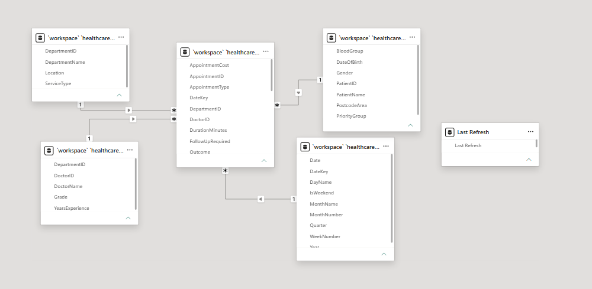
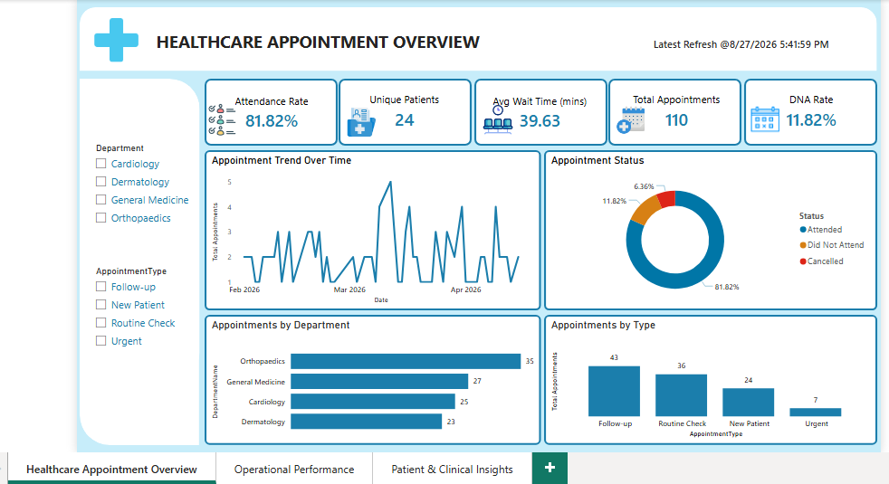
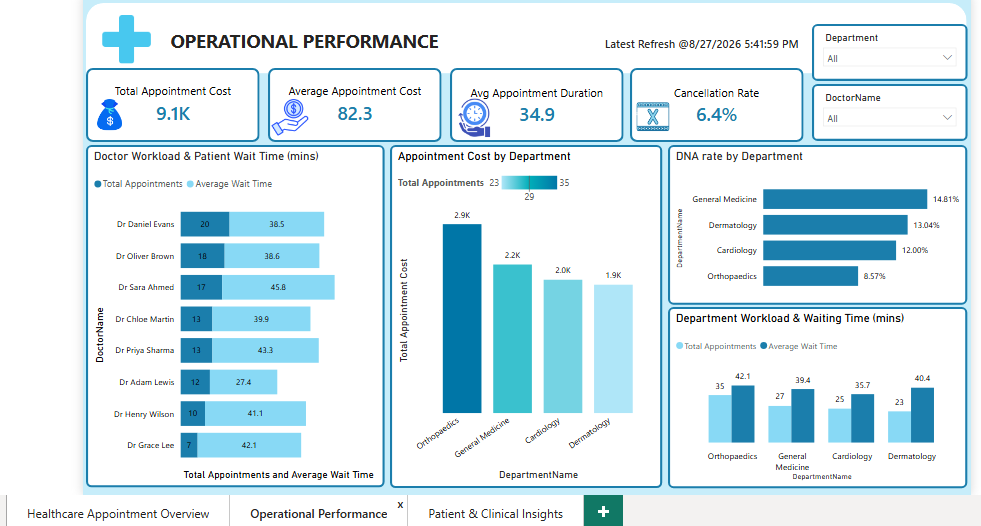
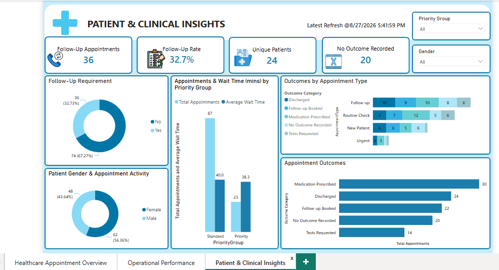

# Healthcare Appointment Analysis

## Project Overview

This project analyses healthcare appointment data to identify patterns in service demand, attendance, waiting times, departmental performance, doctor workload, appointment costs, follow-up requirements and recorded outcomes.

The project follows an end-to-end analytics workflow: the healthcare dataset was loaded into **Databricks**, analysed using **SQL**, connected directly to **Power BI**, and transformed into a three-page interactive dashboard.

The aim was to answer practical operational questions and highlight areas that may warrant further investigation.

---

## Business Questions

1. What is the overall volume of appointments and patients?
2. What are the attendance, Did Not Attend (DNA) and cancellation rates?
3. What are the average patient waiting time and appointment duration?
4. Which departments have the highest workload, waiting times and attendance issues?
5. How do appointment types differ in volume, attendance and cost?
6. How do appointment patterns differ between patient priority groups?
7. How does appointment activity vary over time and between weekdays and weekends?
8. Which departments and appointment types generate the highest appointment costs?
9. How often is follow-up required, and what outcomes are recorded?
10. Are there any important data-quality issues in the appointment records?

---

## Dataset

The model contains **110 appointment records** supported by four dimension tables.

| Table | Description |
|---|---|
| `Fact_Appointment` | Appointment-level activity including status, wait time, duration, cost, outcome and follow-up requirement |
| `Dim_Patient` | Patient information including gender and priority group |
| `Dim_Doctor` | Doctor information including grade, department and years of experience |
| `Dim_Department` | Department name, location and service type |
| `Dim_Date` | Calendar attributes used for time-based analysis |

The dataset contains 25 registered patients, of whom **24 had at least one appointment**.

---

## Data Model

A star-schema approach was used in Power BI, with `Fact_Appointment` at the centre of the model.

- `Dim_Patient[PatientID]` → `Fact_Appointment[PatientID]`
- `Dim_Doctor[DoctorID]` → `Fact_Appointment[DoctorID]`
- `Dim_Department[DepartmentID]` → `Fact_Appointment[DepartmentID]`
- `Dim_Date[DateKey]` → `Fact_Appointment[DateKey]`

All dimension-to-fact relationships use a one-to-many structure.

---

## Tools Used

- **Databricks SQL** — data exploration, validation and business analysis
- **SQL** — joins, aggregations, CASE expressions, CTEs and window functions
- **Power BI** — data modelling, DAX measures and interactive dashboard development
- **DAX** — appointment, attendance, waiting-time, cost and follow-up KPIs
- **GitHub** — project documentation and portfolio presentation

---

## SQL Analysis

SQL was used to answer the business questions before the results were visualised in Power BI.

The analysis covers appointment activity, attendance, waiting times, department performance, appointment types, doctor workload, patient priority groups, time trends, costs, follow-up requirements, outcomes and data quality.

The complete SQL queries, business questions and findings are available in the `sql` folder.

---

## Dashboard

The Power BI report contains three analytical pages.

### 1. Healthcare Appointment Overview

Provides a high-level view of appointment activity, including total appointments, patients with appointments, attendance rate, DNA rate, average waiting time, appointment trends, department demand and appointment types.

### 2. Operational Performance

Examines appointment duration, cancellation rate, costs, department workload, waiting times, DNA performance and doctor workload.

### 3. Patient & Clinical Insights

Explores patient priority groups, follow-up requirements, appointment outcomes and patient appointment activity.

---

## Key Insights

### Attendance

Across **110 appointments**:

- **90** were attended
- **13** were Did Not Attend (DNA)
- **7** were cancelled
- **Attendance rate:** 81.82%
- **DNA rate:** 11.82%
- **Cancellation rate:** 6.36%

DNA represented a larger appointment-loss issue than cancellation within this dataset.

### Waiting Time

Average patient waiting time was **39.63 minutes**, compared with an average appointment duration of **34.91 minutes**.

This identifies waiting time as an important operational metric for further investigation.

### Department Performance

**Orthopaedics** had the highest workload with **35 appointments**, the longest average waiting time at **42.06 minutes**, and the highest attendance rate at **85.71%**.

**General Medicine** had the highest DNA rate at **14.81%**, while **Dermatology** had the lowest attendance rate at **78.26%**.

These findings identify areas for further investigation but do not establish the causes of differences in waiting time or attendance.

### Appointment Costs

**Orthopaedics** generated the highest departmental total appointment cost at **£2,855**.

By appointment type:

- **Follow Up** generated the highest total cost at **£3,400**
- **New Patient** had the highest average cost at **£86.46**

Average appointment costs were relatively similar across departments, suggesting that differences in total departmental cost were primarily associated with appointment volume.

### Follow-Up Requirements

**36 appointments (32.73%)** required follow-up, while **74 (67.27%)** did not.

### Appointment Outcomes

- Medication Prescribed — **30**
- Discharged — **24**
- Follow Up Booked — **22**
- No Outcome Recorded — **20**
- Tests Requested — **14**

---

## Data Quality Observations

No duplicate `AppointmentID` values were identified.

However, **20 appointment records had no recorded outcome**.

These records were retained and labelled **"No Outcome Recorded"** rather than being removed or interpreted as a clinical outcome. This keeps the record-completeness issue visible in the analysis.

---

## Analytical Workflow

**Healthcare Dataset → Databricks → SQL Analysis → Power BI Data Model → DAX Measures → Interactive Dashboard → Business Insights**

SQL was used where required to answer the analytical questions rather than to demonstrate syntax for its own sake. Power BI was then used to validate key results and communicate the findings through interactive reporting.

---

## Note

This project uses a sample healthcare dataset for portfolio and learning purposes. Findings are analytical observations from the supplied dataset and should not be interpreted as clinical conclusions.
